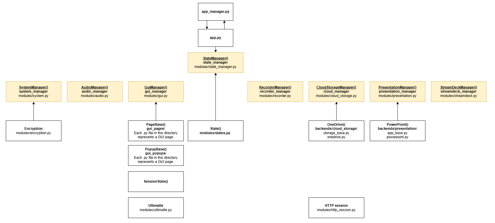
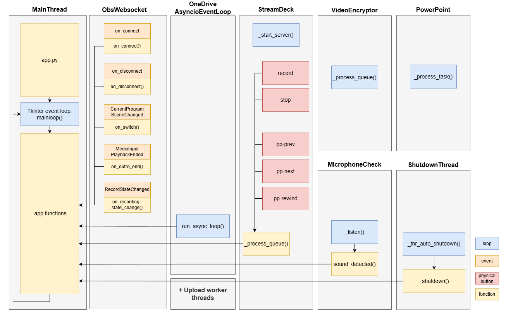

# DIY Studio App

The DIY Studio App provides the user experience for visitors to the Presenter DIY studio. It contains a page-driven user interface that guides users through all the steps required to record videos independently. It communicates with all other hardware and software components in the studio: OBS (the recording software; via WebSocket), PowerPoint (via the Win32 COM interface), OneDrive (via the Microsoft Graph Python API), the Stream Deck (control panel; via WebSocket in combination with a custom plugin) and the Blackmagic Ultimatte (hardware keyer; via Internet socket).

This repository contains only the application for the Presenter DIY studio. The main project for this studio, including assets, Stream Deck plugin and manuals, can be found here: [GitHub repository: presenter-diy-studio](https://github.com/UtrechtUniversity/presenter-diy-studio)

Downloading presentations and uploading video files is handled via cloud storage. Currently, only OneDrive is supported, with the option to add other cloud storage providers later (Nextcloud is being considered).

## Requirements

The following software is required to run the application.
The app has been tested with the exact version numbers listed below, and it is
recommended that these versions are used.

* Python 3.13.7 (there are issues with later 3.13.X versions. 3.14 is currently being tested)
* Python libraries: see requirements.txt
* OBS Studio 32.1.2
* Microsoft OneDrive in combination with Microsoft Entra
* Microsoft PowerPoint 2604
* Microsoft Windows 11 25H2
* Mozilla Firefox 152.0.X

Not strictly required:

* Stream Deck Software Application 7.4.2
* Blackmagic Desktop Video 15.2.0
* Blackmagic Ultimatte 2.3.0.0

## Installation

Clone the repository and install the requirements:

```
git clone git@github.com:UtrechtUniversity/diy-studio-app.git
cd diy-studio-app
pip install -r requirements.txt
```

Rename config/config_example.cfg to config.cfg and enter all required information there, including the OBS password and the client_id for Azure.

Copy app_manager.py to an external location and enter the desired branch, tag and repository_path. This script ensures that patch-level updates are applied automatically by means of 'git checkout', and shuts down the computer after the session in the app has ended.

```
python app_manager.py
```

## Major and minor updates

Updating to new minor and major versions, for example from 1.0.0 to 1.1.0 or 2.0.0, must be done manually:

```
git reset --hard
git checkout v1.1.0
```

## Structure

The DIY Studio App consists of a series of modules, each controlled by a manager. Modules communicate with each other via the route_call() function of these managers.

The backbone is the *StateManager*, which handles switching between pages in the GUI and may also issue instructions to other managers associated with a particular page.

The remaining managers are:
* AudioManager
* CloudStorageManager
* GuiManager
* PresentationManager
* RecorderManager
* StreamDeckManager
* SystemManager


## Loops, events, threads
An overview of loops, events and threads used by the app.



## Copyright and license
Copyright © 2026 Utrecht University

The source code of this project is licensed under the European Union Public Licence v1.2 (EUPL-1.2). See LICENSE for the full English text. For other languages, see:
[EUPL license collection](https://interoperable-europe.ec.europa.eu/collection/eupl/eupl-text-eupl-12)

Assets are generally licensed under the EUPL v1.2, with the exception of fonts, logos and third-party assets, which are licensed separately or remain the property of their respective rights holders. See `assets/LICENSE`.

Third party libraries used in this project have their own licenses.
These can be found in the `licenses` directory.

## Questions?
Maintainer: Wouter Verwijlen - w.j.verwijlen@uu.nl
